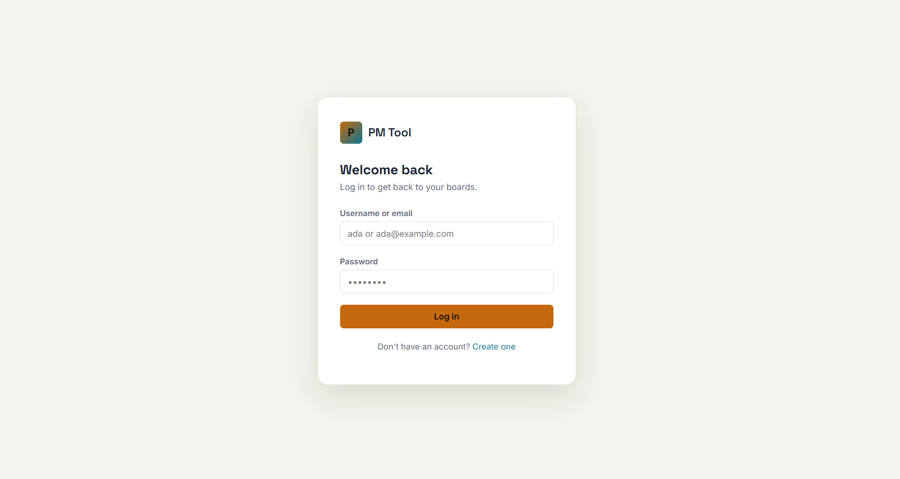
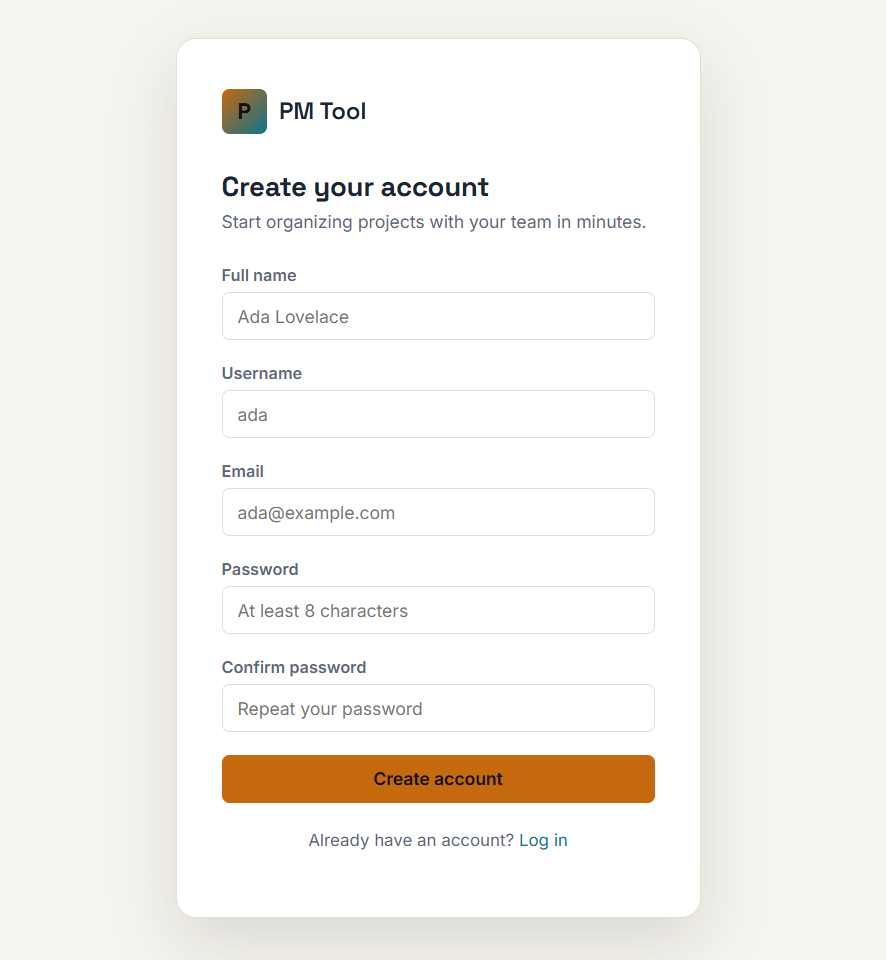
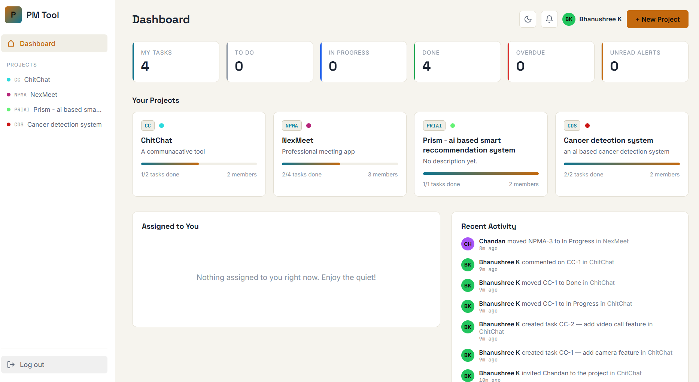
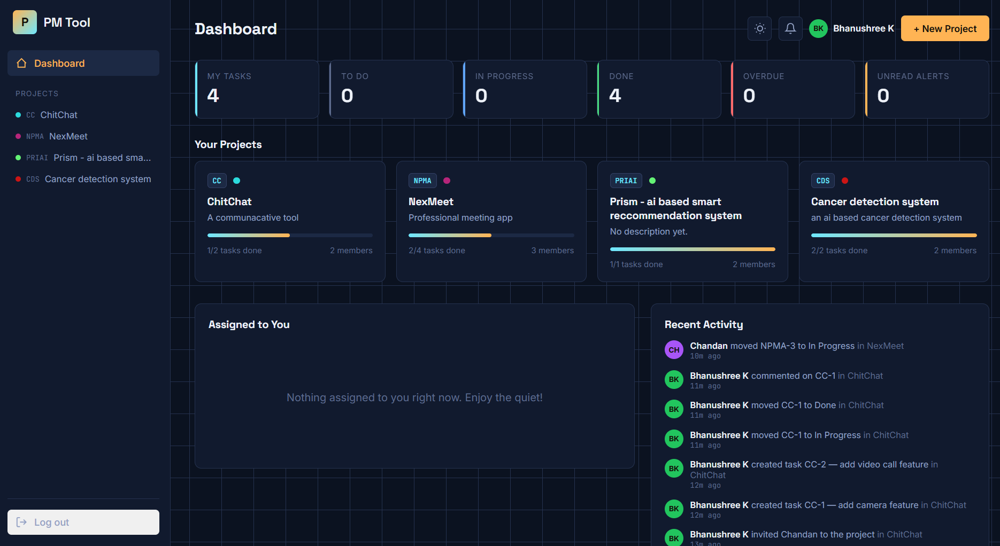
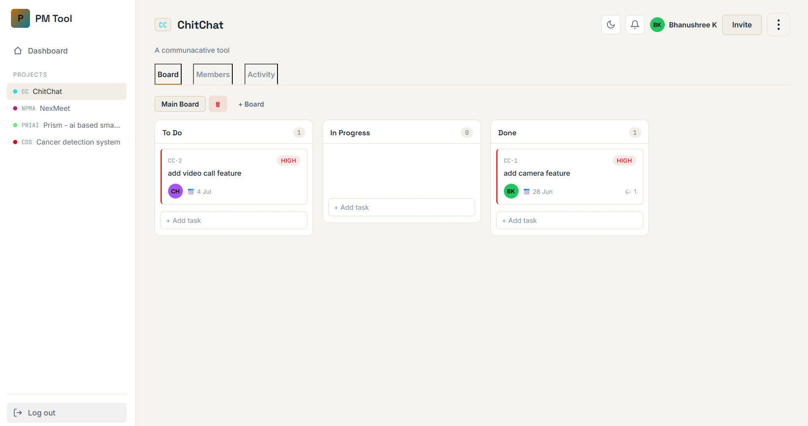
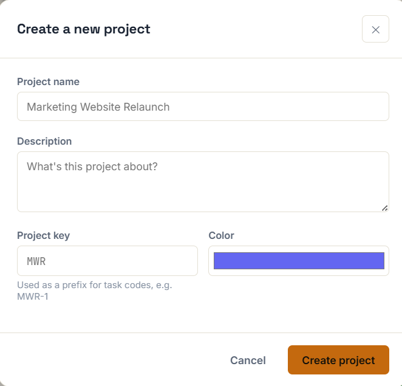
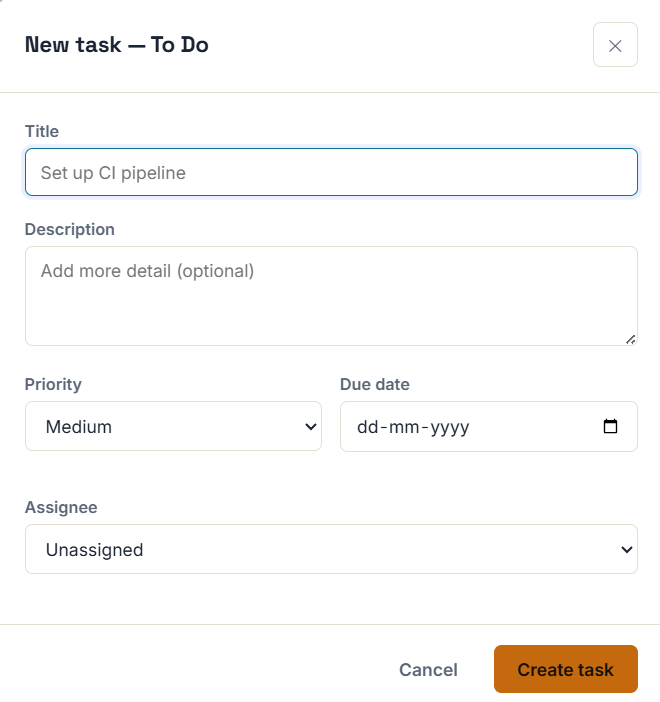
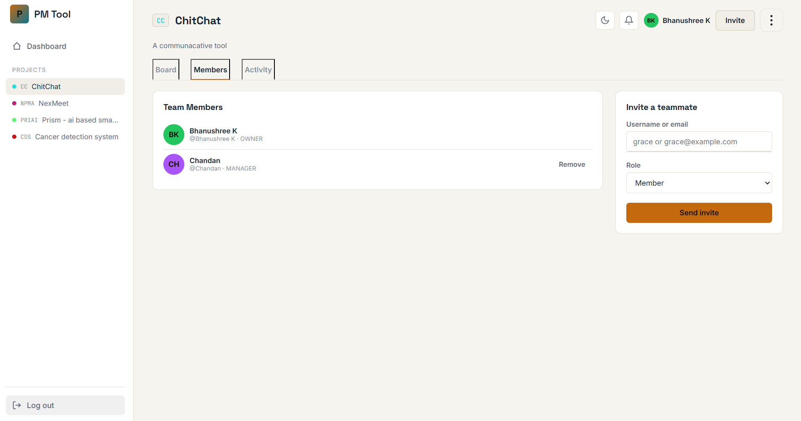
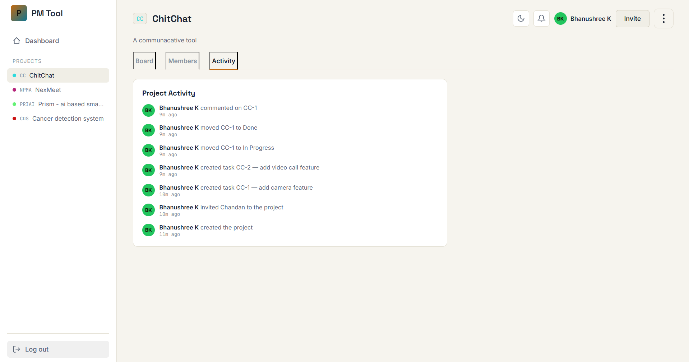
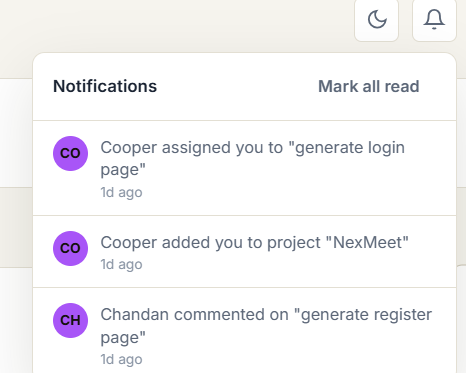

### CodeAlpha Full Stack Development Internship – Task 3


# PM Tool — Project Management Platform

This project was developed as part of the CodeAlpha Full Stack Development Internship.

The application is a collaborative Project Management Tool inspired by Trello and Asana. It enables teams to create projects, organize tasks on Kanban boards, assign work, collaborate through comments, and receive real-time updates using WebSockets.

---

## ✅ Internship Requirements Covered

- ✅ Authentication System
- ✅ Create Group Projects
- ✅ Project Boards
- ✅ Create/Delete boards
- ✅ Task Cards
- ✅ Assign Tasks
- ✅ Comment within Tasks
- ✅ Backend for Users
- ✅ Backend for Projects
- ✅ Backend for Tasks
- ✅ Backend for Comments
- ✅ Notifications
- ✅ Real-Time Updates using WebSockets

---

## ✨ Features

- **Authentication & Authorization** — registration, login, JWT access + refresh tokens, BCrypt password hashing, protected API routes, role-based access (Admin / Project Manager / Member at the system level, Owner / Manager / Member at the project level).
- **Projects** — create, edit, view, invite/remove members, update details, and permanently delete projects with role-based permissions.
- **Boards** — every project gets a default Kanban board; create additional boards for sprints, teams, or workstreams.
- **Tasks** — create, assign, edit, delete; priority (Low/Medium/High), status (To Do / In Progress / Done), due dates, human-readable task codes (e.g. `MWR-14`), drag-and-drop between columns.
- **Comments** — threaded discussion per task, `@username` mentions, live updates as teammates type.
- **Dashboard** — task stats, your projects, tasks assigned to you, overdue tasks, recent activity feed.
- **Notifications** — task assigned, status changed, new comment, mention, project invite — delivered live over WebSocket and persisted so you never miss one.
- **Real-time** — Spring WebSocket + STOMP push live task moves, live comments, and live notifications to every open tab without refreshing.
- **UI** — responsive layout, full dark/light mode, drag-and-drop cards, toast notifications, skeleton loading states.

---

## 🧱 Tech Stack

| Layer       | Technology |
|-------------|------------|
| Frontend    | HTML5, CSS3 (custom design system, no framework), vanilla JavaScript |
| Backend     | Java 21, Spring Boot 3.3, Spring Security, Spring Data JPA, Spring WebSocket (STOMP) |
| Auth        | JWT (access + refresh tokens), BCrypt |
| Database    | MySQL 8 |
| Real-time   | STOMP over WebSocket (SockJS fallback) |

---

## 📁 Project Structure

```
pmtool/
├── backend/                          Spring Boot REST + WebSocket API
│   ├── pom.xml
│   └── src/main/
│       ├── java/com/pmtool/
│       │   ├── config/               Security, CORS, WebSocket, seed data
│       │   ├── controller/           REST endpoints
│       │   ├── dto/request/          Request payloads
│       │   ├── dto/response/         Response payloads
│       │   ├── entity/               JPA entities
│       │   ├── enums/                TaskStatus, TaskPriority, ProjectRole, NotificationType
│       │   ├── exception/            Custom exceptions + global handler
│       │   ├── repository/           Spring Data JPA repositories
│       │   ├── security/             JWT filter, JWT utils, UserDetails
│       │   ├── service/              Business logic
│       │   └── util/                 SecurityUtils
│       └── resources/application.yml
├── frontend/                         Static HTML/CSS/JS client
│   ├── index.html                    Login
│   ├── register.html                 Sign up
│   ├── dashboard.html                Dashboard
│   ├── project.html                  Kanban board, task modal, members, activity
│   ├── css/style.css
│   └── js/  (api, auth, dashboard, project, shell, websocket, toast, theme, utils)
├── database/
│   └── schema.sql                    Full CREATE TABLE schema + seed roles
├── docker-compose.yml                One-command local MySQL
└── README.md
```

---

## 📸 Screenshots

### Authentication

#### Login


#### Register


---

### Dashboard

#### Dashboard


#### Dark Mode


---

### Project Management

#### Project Board (Kanban)


#### Create New Project


#### Create Task


---

### Collaboration

#### Team Members


#### Project Activity


#### Notifications


---

## 🚀 Getting Started

### Prerequisites

- Java 21 (JDK)
- Maven 3.9+
- MySQL 8 (or Docker, see below)
- Any static file server for the frontend (VS Code "Live Server" extension, `python3 -m http.server`, etc. — opening the HTML files directly via `file://` will break CORS and the WebSocket connection)

### 1. Start MySQL

**Option A — Docker (recommended, fastest):**
```bash
docker compose up -d
```
This boots MySQL 8 on port `3306` and automatically loads `database/schema.sql` on first start.

**Option B — Local MySQL install:**
```bash
mysql -u root -p < database/schema.sql
```

### 2. Configure the backend

Defaults in `backend/src/main/resources/application.yml` already match the Docker setup (`root` / `root`, `pmtool_db`). To override, set environment variables instead of editing the file:

| Variable | Default | Purpose |
|---|---|---|
| `DB_USERNAME` | `root` | MySQL username |
| `DB_PASSWORD` | `root` | MySQL password |
| `JWT_SECRET` | (dev key included) | Base64 HMAC signing key — **set a real secret in production** |
| `JWT_EXPIRATION_MS` | `86400000` (24h) | Access token lifetime |
| `JWT_REFRESH_EXPIRATION_MS` | `604800000` (7d) | Refresh token lifetime |
| `CORS_ORIGINS` | `localhost:5500,...` | Comma-separated list of allowed frontend origins |

### 3. Run the backend

```bash
cd backend
mvn spring-boot:run
```
The API starts on `http://localhost:8080/api`. On first boot, `DataSeeder` inserts the three system roles (`ROLE_ADMIN`, `ROLE_PROJECT_MANAGER`, `ROLE_MEMBER`) if they don't already exist.

### 4. Run the frontend

From the `frontend/` folder, serve the static files (don't just double-click the HTML — the browser's `file://` origin breaks CORS and WebSocket handshakes):

```bash
cd frontend
python3 -m http.server 5500
```
Then open **http://localhost:5500**. If your frontend runs on a different port, add it to `CORS_ORIGINS`.

### 5. Try it out

1. Register two accounts (e.g. `ada` and `grace`) in two browser tabs.
2. As `ada`, create a project and invite `grace` by username.
3. Create a task, assign it to `grace` — her notification bell updates **instantly**, live, with no refresh.
4. Drag the task to "In Progress" and watch it move in `grace`'s tab in real time.
5. Open the task and post a comment with `@grace` — it appears live in both tabs.

---

## 🔌 REST API Reference

Base URL: `http://localhost:8080/api`

| Method | Endpoint | Description |
|---|---|---|
| POST | `/auth/register` | Create an account |
| POST | `/auth/login` | Log in, returns access + refresh tokens |
| POST | `/auth/refresh` | Exchange a refresh token for a new pair |
| GET | `/users/me` | Current user profile |
| GET | `/users/search?q=` | Search users (assignee/invite autocomplete) |
| GET | `/dashboard` | Aggregated dashboard data |
| POST | `/projects` | Create a project |
| GET | `/projects` | List your projects |
| GET | `/projects/{id}` | Project detail + members |
| PUT | `/projects/{id}` | Update a project |
| DELETE | `/projects/{id}` | Delete a project (owner only) |
| GET | `/projects/{id}/members` | List members |
| POST | `/projects/{id}/members` | Invite a member |
| DELETE | `/projects/{id}/members/{userId}` | Remove a member |
| GET | `/projects/{id}/activity` | Recent project activity |
| POST | `/projects/{id}/boards` | Create a board |
| GET | `/projects/{id}/boards` | List boards (with tasks) |
| DELETE | `/boards/{id}` | Delete a board |
| POST | `/tasks` | Create a task |
| GET | `/tasks/{id}` | Task detail |
| GET | `/tasks/assigned-to-me` | Tasks assigned to the current user |
| PUT | `/tasks/{id}` | Update a task |
| PATCH | `/tasks/{id}/move` | Drag-and-drop: update status + position |
| DELETE | `/tasks/{id}` | Delete a task |
| GET | `/tasks/{id}/comments` | List comments |
| POST | `/tasks/{id}/comments` | Add a comment (supports `@mentions`) |
| DELETE | `/comments/{id}` | Delete your own comment |
| GET | `/notifications` | List notifications |
| GET | `/notifications/unread-count` | Unread count for the bell badge |
| PATCH | `/notifications/{id}/read` | Mark one as read |
| PATCH | `/notifications/read-all` | Mark all as read |

All endpoints except `/auth/**` require `Authorization: Bearer <accessToken>`.

## 📡 WebSocket (STOMP) Reference

Connect to `ws://localhost:8080/api/ws` (SockJS-compatible), authenticating by sending a STOMP `CONNECT` frame with header `Authorization: Bearer <accessToken>`.

| Destination | Direction | Payload |
|---|---|---|
| `/topic/projects/{projectId}/tasks` | Subscribe | `{ event: "TASK_CREATED" \| "TASK_UPDATED" \| "TASK_MOVED" \| "TASK_DELETED", data }` |
| `/topic/projects/{projectId}/activity` | Subscribe | Activity log entry |
| `/topic/tasks/{taskId}/comments` | Subscribe | New comment |
| `/user/queue/notifications` | Subscribe | New notification (assigned, status change, comment, mention, invite) |

---

## 🗄️ Database Schema

See [`database/schema.sql`](database/schema.sql) for the full DDL. Summary:

- **users**, **roles**, **user_roles** — accounts and system-level RBAC
- **projects**, **project_members** — projects and per-project roles (Owner/Manager/Member)
- **boards** — Kanban boards, many per project
- **tasks** — cards with status, priority, due date, assignee, reporter, task code
- **comments**, **comment_mentions** — task discussion + @mentions
- **notifications** — persisted, real-time-pushed alerts
- **activity_log** — human-readable audit trail powering the activity feed

---

## 🔐 Security Notes

- Passwords are hashed with BCrypt (strength 12), never stored or logged in plaintext.
- All state-changing endpoints require a valid JWT; the filter chain rejects unauthenticated requests before they reach a controller.
- Project-level authorization is enforced in the service layer (`ProjectService.ensureMember` / `ensureManagerOrOwner`) — a user who isn't a project member gets a 403 even if they guess a valid task or board ID.
- The bundled JWT secret in `application.yml` is for **local development only** — replace it with a securely generated secret via the `JWT_SECRET` environment variable before deploying anywhere.

---

## 7. Author

**Bhanushree K**
Bachelor of Engineering (Computer Science)
GSSSIETW, Mysuru

---

## 8. License

This project was developed as part of my internship portfolio to demonstrate my skills in full-stack development.

The source code is shared for learning and evaluation purposes.
---