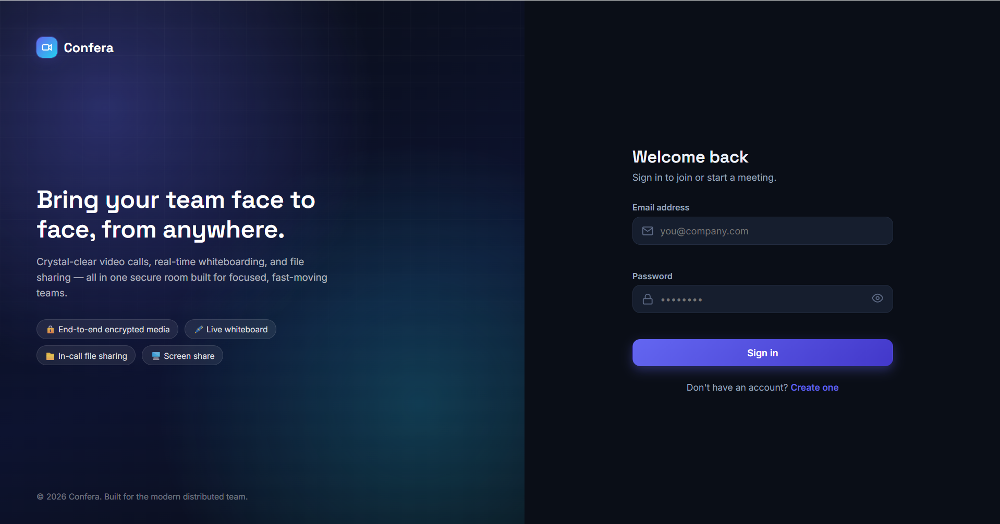
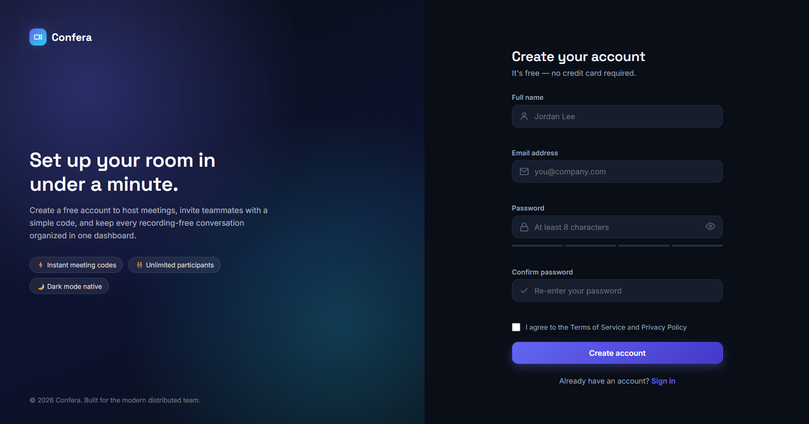
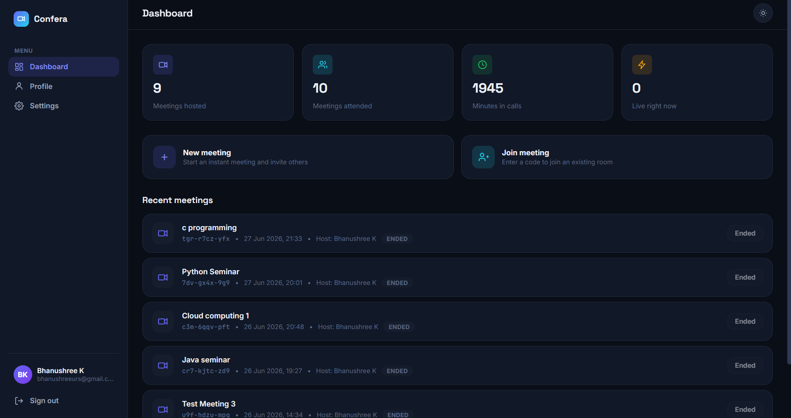
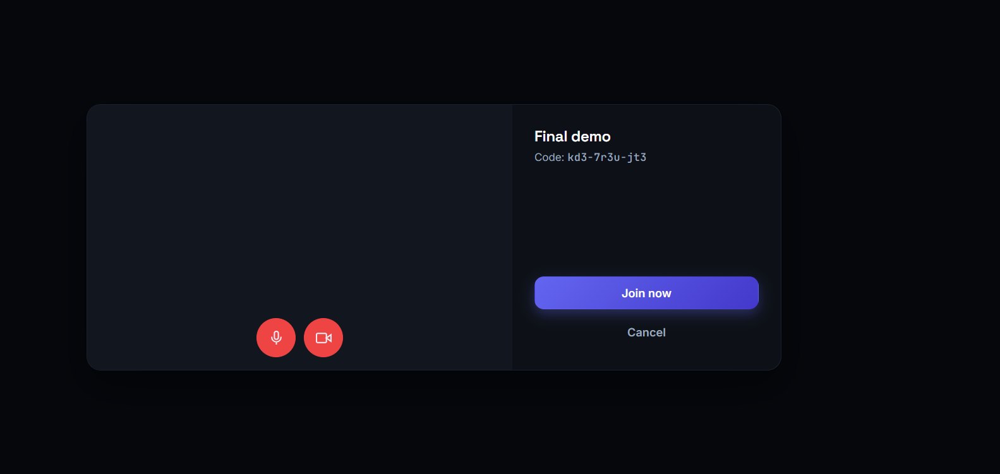
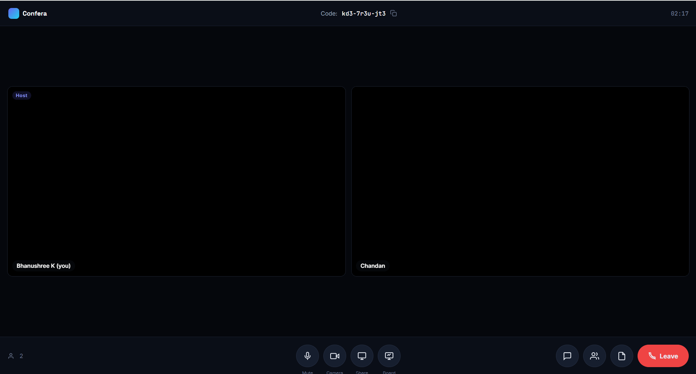
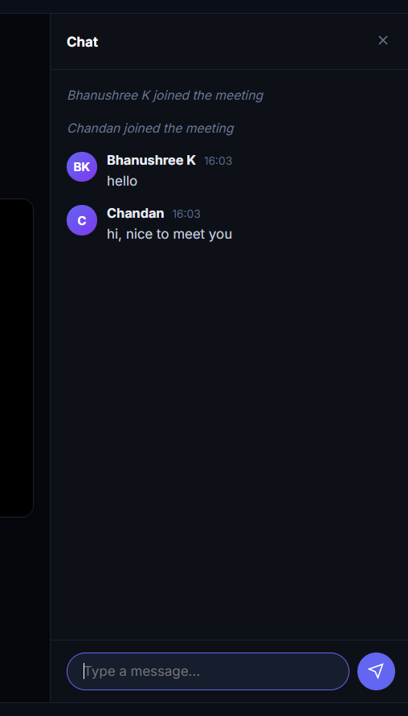
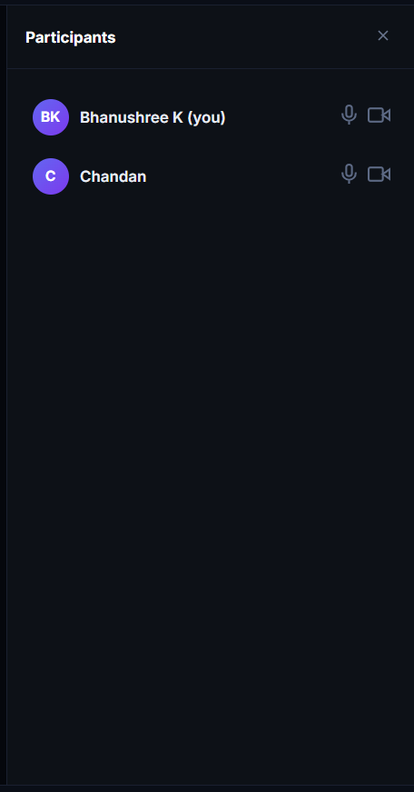
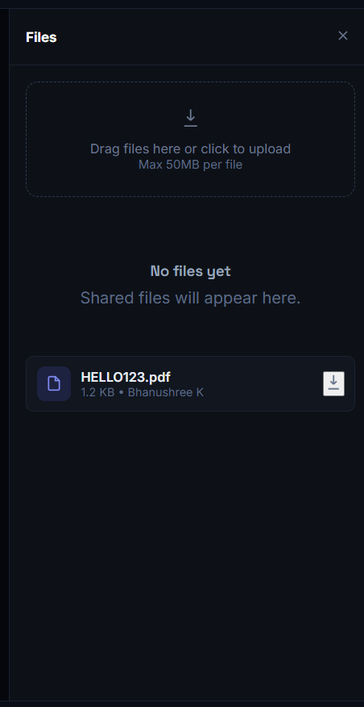
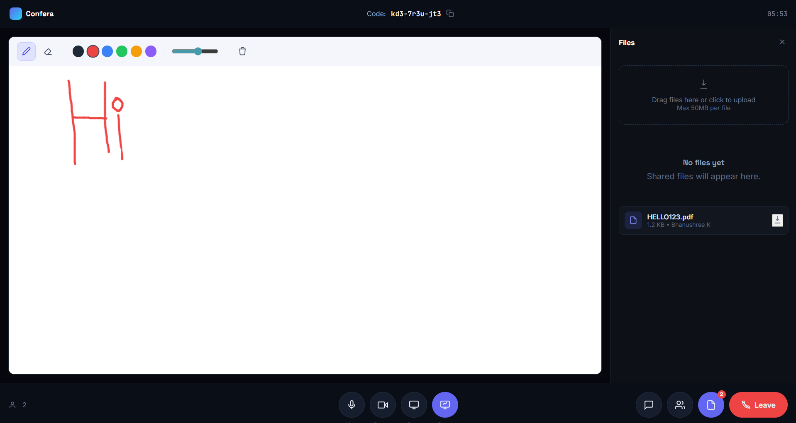

### CodeAlpha Full Stack Development Internship – Task 4

# Confera — Real-Time Video Conferencing & Collaboration Platform

A full-stack video conferencing and collaboration platform built using Java Spring Boot, WebRTC, WebSockets, MySQL, and JavaScript.

Developed as part of my internship full stack dvelopment project, Confera demonstrates secure backend development, peer-to-peer communication, and real-time collaboration through video calling, screen sharing, whiteboarding, chat, and file sharing.

**Stack:** Java 21 · Spring Boot 3 · Spring Security · Spring WebSocket (STOMP) · MySQL · vanilla HTML5/CSS3/JavaScript · WebRTC · Canvas API

---

## 1. Features

| Area | What's implemented |
|---|---|
| **Auth** | Register/login, BCrypt password hashing, stateless JWT (access token), route guarding on every protected page |
| **Meetings** | Create, join by code, leave, host-only end; meeting history & "currently hosting" dashboard views |
| **Video calling** | Full-mesh WebRTC — every participant connects directly to every other participant; audio/video flows peer-to-peer, encrypted via DTLS-SRTP |
| **Screen sharing** | `getDisplayMedia()` + `RTCRtpSender.replaceTrack()` swaps your camera feed for your screen in every existing connection, no renegotiation needed |
| **Whiteboard** | Canvas-based collaborative drawing, pen + eraser, color/brush size, synced in real time over STOMP, resize-safe via normalized coordinates |
| **Chat** | Persisted message history (REST) + live delivery (STOMP), unread badge |
| **File sharing** | Drag-and-drop upload with progress bar, authenticated download, extension blocklist, path-traversal-safe storage |
| **Security & Encryption** | JWT Authentication, BCrypt password hashing, Role-Based Access Control (RBAC), WebRTC media encrypted using DTLS-SRTP, secure file upload validation, protected REST APIs and WebSocket connections |
| **UX** | Dark mode (default) + light mode, toast notifications, loading states, responsive layout down to mobile widths |
| **Pages** | Login, register, dashboard, meeting room (lobby + live room), profile, settings |

---

## 2. 📸 Application Screenshots

### 2.1. Login Page
Secure user login with JWT authentication.



---

### 2.2. User Registration
Create a new account with password validation.



---

### 2.3. Dashboard
View meeting statistics, recent meetings, and create or join meetings.



---

### 2.4. Meeting Lobby
Preview camera and microphone settings before joining a meeting.



---

### 2.5. Video Conference
Real-time video conferencing with multiple participants.



---

### 2.6. Real-time Chat
Send and receive messages instantly during meetings.



---

### 2.7. Participants Panel
View all meeting participants and their media status.



---

### 2.8. File Sharing
Upload and download files securely within a meeting.



---

### 2.9. Collaborative Whiteboard
Draw and collaborate with meeting participants in real time.



---

## 3. Project structure

```
video-conference-app/
├── backend/                  Spring Boot REST + WebSocket API
│   ├── pom.xml
│   └── src/main/java/com/vconf/
│       ├── entity/            JPA entities (User, Meeting, MeetingParticipant, ChatMessage, FileMetadata, Role)
│       ├── repository/        Spring Data JPA repositories
│       ├── dto/                Request/response DTOs (incl. WebRTC SignalMessage, WhiteboardEvent)
│       ├── security/           JwtUtil, JwtAuthenticationFilter, JwtChannelInterceptor, StompPrincipal
│       ├── config/             SecurityConfig, WebSocketConfig, WebConfig
│       ├── service/             AuthService, UserService, MeetingService, ChatService, FileStorageService
│       ├── controller/          REST controllers
│       ├── controller/ws/       STOMP @MessageMapping controllers (signaling, chat, whiteboard)
│       └── exception/           Custom exceptions + @RestControllerAdvice handler
└── frontend/                  Static HTML/CSS/JS (no build step, no framework)
    ├── index.html              Login
    ├── register.html
    ├── dashboard.html
    ├── meeting.html            Lobby + live meeting room
    ├── profile.html
    ├── settings.html
    ├── css/                    variables, base, components, auth, dashboard, meeting
    └── js/                     config, api, auth, toast, theme, dashboard/profile/settings,
                                 websocket, webrtc, whiteboard, chat, fileshare, meeting (orchestrator)
```

---

## 4. Running it locally

### Prerequisites
- JDK 21
- Maven 3.9+ (or use your IDE's built-in Maven)
- MySQL 8 running locally (or adjust the env vars below to point elsewhere)
- Node.js (recommended for serving the frontend using http-server)

### 4.1 Database
Create a database (or let Hibernate do it for you — the JDBC URL includes
`createDatabaseIfNotExist=true`):
```sql
CREATE DATABASE IF NOT EXISTS vconf_db;
```
Tables are created/updated automatically on startup via `ddl-auto: update`
— no manual schema scripts to run.

### 4.2 Backend
The default values in `application.yml` work for local development.

If you need different database credentials or ports, update the environment variables or modify `application.yml` accordingly.
```bash
cd backend
mvn spring-boot:run
```
The API starts on **http://localhost:8080**.

### 4.3 Frontend
The frontend is plain static files — no npm install, no build step.

**Option A — (Recommended)**

```bash
cd frontend
npx http-server
```

Then visit:

```
http://127.0.0.1:8081
```

**Option B — Python**

```bash
cd frontend
python -m http.server 8000
```

Then visit:

```
http://localhost:8000
```
If you serve the frontend on a different port, add it to `CORS_ORIGINS`
(backend) and it'll just work — Update the allowed CORS origins in the backend configuration if serving the frontend from a different port.

## 4.4 Deployment Status

The application has been successfully built, deployed, and tested in a local development environment.

Verified features include:

- ✅ User Authentication
- ✅ Multi-user Video Calling
- ✅ Screen Sharing
- ✅ Collaborative Whiteboard
- ✅ Real-time Chat
- ✅ File Sharing
- ✅ JWT Authentication
- ✅ WebSocket (STOMP) Communication
- ✅ WebRTC Peer-to-Peer Streaming
- ✅ MySQL Database Integration

### 4.5 First run
1. Open the frontend → **Create one** (register) → you'll land on the dashboard.
2. Click **New meeting** to create + jump straight into a room, or **Join meeting** with a code.
3. Open the same meeting URL in a second browser profile/incognito window (or another device on the same network) to test multi-user video, chat, whiteboard, and file sharing.
4. Allow camera/microphone permissions when prompted.

---

## 5. How the real-time pieces work

### WebRTC mesh (video/audio/screen share)
Every pair of participants gets exactly **one** `RTCPeerConnection`. When a
new participant joins:
1. They broadcast a `JOIN` signal over `/app/signal/{meetingCode}`.
2. Every *existing* participant reacts by creating a peer connection, adding
   their local tracks, and sending an `OFFER` addressed to the new peer.
3. The new peer answers; both sides' `ontrack` fires because both added
   tracks to the same connection — one connection carries both directions.
4. ICE candidates are exchanged the same way, buffered until the remote
   description is set.

The backend's `SignalingController` is a **pure relay** — it never inspects
SDP/ICE payloads. Actual media never touches the server; it flows
peer-to-peer over DTLS-SRTP (mandatory, built into WebRTC). The STOMP
topic is broadcast-and-filter: every client receives every signal message
for the room and ignores ones not addressed to it, which keeps the server
topology-agnostic for small meetings.

Screen sharing reuses the *same* connections: `RTCRtpSender.replaceTrack()`
swaps the outgoing video track from camera → screen (and back), so there's
no renegotiation, no new connection, and no flicker.

### Whiteboard
Strokes are captured with the Pointer Events API (works for mouse, touch,
and stylus), normalized to `[0,1]` coordinates, and broadcast over
`/app/whiteboard/{meetingCode}`. Normalizing means two participants with
different window sizes still see strokes land in the same relative spot.
Strokes are kept in memory per-session (not persisted to the DB) and
replayed on canvas resize so they don't disappear if you resize the window.

### Chat
Messages are persisted (`ChatMessage` entity) *and* broadcast live, so
opening the chat panel later in the same session — or reloading the chat
history endpoint — still shows everything that was said.

### File sharing
Uploads go through a normal multipart REST endpoint (so XHR can report
upload progress, which `fetch()` doesn't expose cleanly for uploads).
Downloads are fetched as an authenticated blob (the JWT has to go in an
`Authorization` header, which a plain `<a href>` can't send) and then
turned into a temporary `URL.createObjectURL()` link.

---

## 6. Security Features

- JWT-based Authentication
- BCrypt Password Hashing
- Role-Based Access Control (RBAC)
- WebRTC Media Encryption (DTLS-SRTP)
- Protected REST APIs
- Protected WebSocket (STOMP) Connections
- Secure File Upload Validation
- CORS Allow-list Configuration
- Input Validation and Exception Handling

---

## 7. Author

**Bhanushree K**
Bachelor of Engineering (Computer Science)
GSSSIETW, Mysuru

---

## 8. License

This project was developed as part of my internship portfolio to demonstrate my skills in full-stack development.

The source code is shared for learning and evaluation purposes.
---