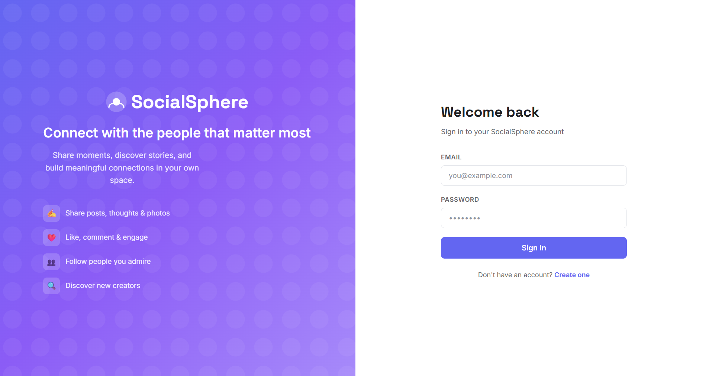
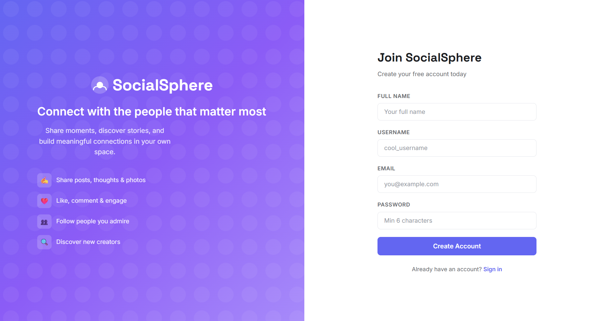
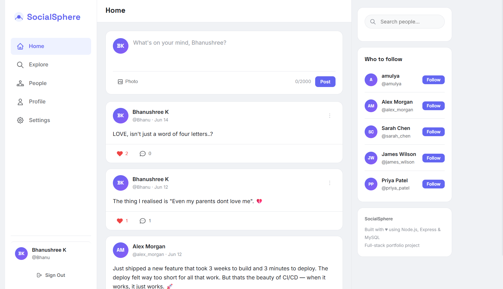
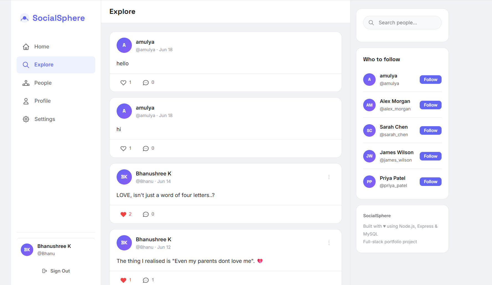
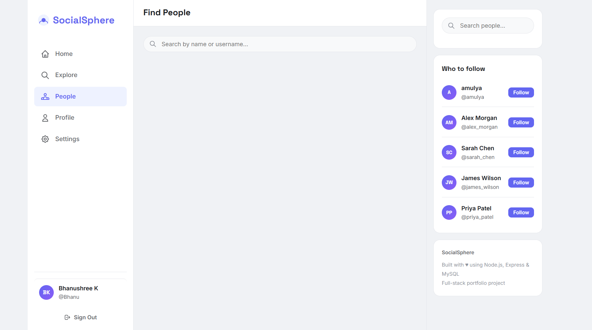
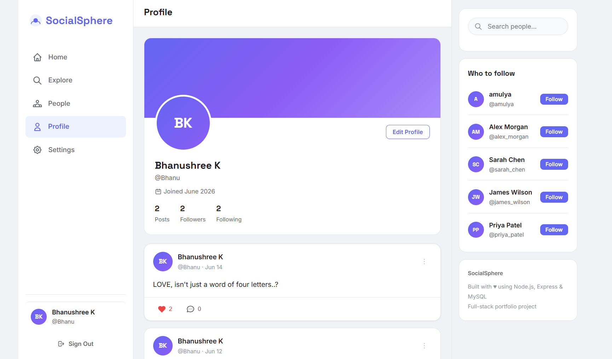
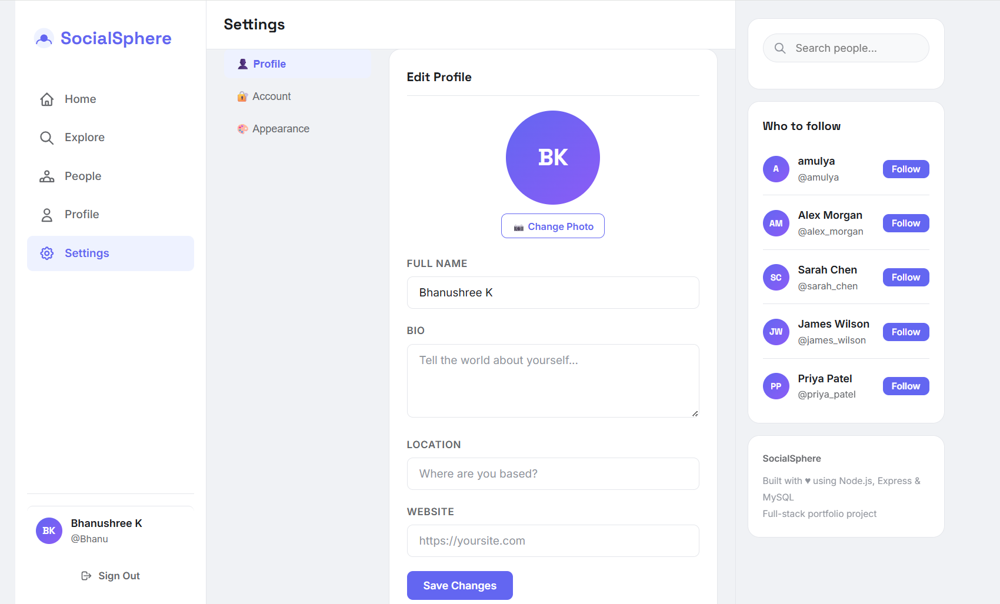
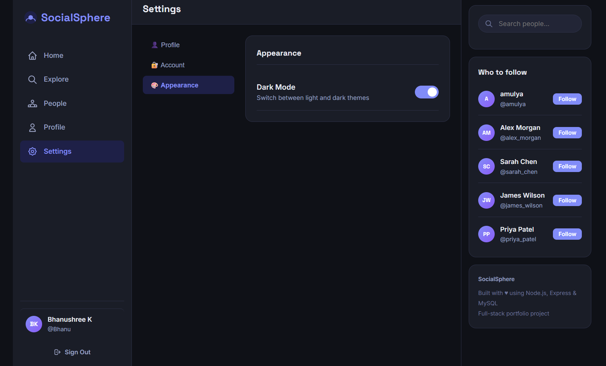

### CodeAlpha Full Stack Development Internship – Task 2

# 🌐 SocialSphere — Full-Stack Social Media Platform

## 📌 Project Overview

SocialSphere is a mini social media platform developed as part of the **CodeAlpha Full Stack Development Internship (Task 2)**.

The project fulfills all the required task objectives by providing user profiles, posts, comments, likes, follow system, authentication, and a responsive user interface using HTML, CSS, JavaScript, Express.js, and MySQL.

---

## ✅ CodeAlpha Task Requirements

| Requirement | Status |
|------------|--------|
| User Profiles | ✅ Implemented |
| Posts | ✅ Implemented |
| Comments | ✅ Implemented |
| Like System | ✅ Implemented |
| Follow System | ✅ Implemented |
| HTML, CSS & JavaScript Frontend | ✅ |
| Express.js Backend | ✅ |
| MySQL Database | ✅ |

---

## 🚀 Implemented Features

| Feature | Details |
|---|---|
| 🔐 Authentication | Register, Login, Logout with bcrypt password hashing |
| 👤 User Profiles | Full profile with bio, location, website, profile picture upload |
| 📝 Posts | Create, edit, delete posts with optional image attachments |
| 💬 Comments | Add and delete comments on any post |
| ❤️ Likes | Like/unlike posts with animated feedback |
| 👥 Follow System | Follow/unfollow users, follower & following counts |
| 🔍 User Search | Live search by name or username |
| 📄 Pagination | Paginated home feed, explore feed, and profile posts |
| 🌙 Dark Mode | Persistent dark/light theme toggle |
| 📱 Responsive UI | Mobile-first design with bottom navigation |
| 🖼️ Image Uploads | Profile pictures and post image uploads |
| 🌍 Explore Feed | Browse posts shared by all users |
| 👥 Followers & Following | View follower and following lists |

---

## 🛠️ Tech Stack

**Frontend**
- HTML5, CSS3, Vanilla JavaScript (SPA-style routing)
- Google Fonts (Inter + Space Grotesk)
- CSS custom properties for theming

**Backend**
- Node.js + Express.js
- express-session (authentication)
- express-fileupload (image uploads)
- bcryptjs (password hashing)
- Sequelize ORM

**Database**
- MySQL 8+
- Tables: users, posts, comments, followers, likes

---

## 📁 Project Structure

```
socialsphere/
├── config/
│   └── database.js          # Sequelize DB connection
├── middleware/
│   └── auth.js              # Session auth guards
├── models/
│   └── index.js             # Sequelize models & associations
├── public/
│   ├── css/
│   │   └── style.css        # Full stylesheet (light + dark)
│   ├── js/
│   │   └── app.js           # Frontend SPA logic
│   ├── uploads/             # User-uploaded images
│   ├── index.html           # Auth pages (login/register)
│   └── app.html             # Main app shell
├── routes/
│   ├── auth.js              # /api/auth/* endpoints
│   ├── posts.js             # /api/posts/* endpoints
│   └── users.js             # /api/users/* endpoints
├── database.sql             # MySQL schema + seed data
├── server.js                # Express entry point
├── package.json
├── .env.example
└── .gitignore
```

---

## ⚙️ Setup & Installation

### Prerequisites
- Node.js v18+
- MySQL 8+

### 1. Clone the repository
```bash
git clone https://github.com/bhanushreek/socialsphere.git
cd socialsphere
```

### 2. Install dependencies
```bash
npm install
```

### 3. Set up the database
```bash
# Log into MySQL
mysql -u root -p

# Run the schema
source database.sql
```

### 4. Configure environment

Create a `.env` file in the project root using `.env.example` as a reference, then update the following values:

```env
DB_HOST=localhost
DB_USER=your_mysql_username
DB_PASSWORD=your_mysql_password
DB_NAME=socialsphere
SESSION_SECRET=your_secret_key
```

---

### 5. Start the server
```bash
# Development (with auto-reload)
npm run dev

# Production
npm start
```

### 6. Open in browser
```
http://localhost:3000
```

---

## 🎨 Screenshots

### Login


### Register


### Home Feed


### Explore Feed


### People Search


### Profile


### Settings


### Dark Mode


---

## 🗄️ Database Schema

```sql
users       — id, username, email, password, full_name, bio, profile_picture, website, location
posts       — id, user_id, content, image_url, is_edited
comments    — id, post_id, user_id, content
likes       — id, post_id, user_id  (unique constraint)
followers   — id, follower_id, following_id  (unique constraint)
```

---

## 📡 API Endpoints

### Auth
| Method | Endpoint | Description |
|---|---|---|
| POST | `/api/auth/register` | Register new user |
| POST | `/api/auth/login` | Login user |
| POST | `/api/auth/logout` | Logout user |

### Posts
| Method | Endpoint | Description |
|---|---|---|
| GET | `/api/posts` | Get feed posts (paginated) |
| GET | `/api/posts/explore` | Get all posts (paginated) |
| POST | `/api/posts` | Create post (supports image) |
| PUT | `/api/posts/:id` | Edit own post |
| DELETE | `/api/posts/:id` | Delete own post |
| POST | `/api/posts/:id/like` | Toggle like on post |
| POST | `/api/posts/:id/comments` | Add comment |
| DELETE | `/api/posts/:postId/comments/:commentId` | Delete own comment |

### Users
| Method | Endpoint | Description |
|---|---|---|
| GET | `/api/users/me` | Get current user |
| GET | `/api/users/search?q=query` | Search users |
| GET | `/api/users/:username` | Get user profile + posts |
| PUT | `/api/users/me/update` | Update profile (supports avatar) |
| PUT | `/api/users/me/password` | Change password |
| POST | `/api/users/:username/follow` | Toggle follow |
GET| `/api/users/:username/followers` | Get follower list
---
GET| `/api/users/:username/following` | Get following list
---

## 🎨 Screenshots

> Home Feed · Profile Page · Dark Mode · Search · Settings


---

## 🧠 Key Implementation Highlights

- **SPA-style routing** without a framework — `history.pushState` + route matching
- **Session-based auth** with `express-session`, protected routes on both frontend and backend
- **Optimistic UI** — likes and comments update instantly without page reload
- **Debounced search** — live user search with 350ms debounce
- **CSS custom properties** — full dark mode via a single `data-theme` attribute swap
- **Sequelize associations** — complex JOIN queries via ORM (posts → user, comments, likes)
- **File upload pipeline** — `express-fileupload` → disk → served as static files
- **Pagination** — server-side pagination for feeds and profile posts

---

## Author

**Bhanushree K**
Bachelor of Engineering (Computer Science)
GSSSIETW, Mysuru

---

## License

This project was developed as part of the CodeAlpha Full Stack Development Internship to demonstrate my full-stack development skills. 

The source code is released under the MIT License and may be used for learning and reference.

---